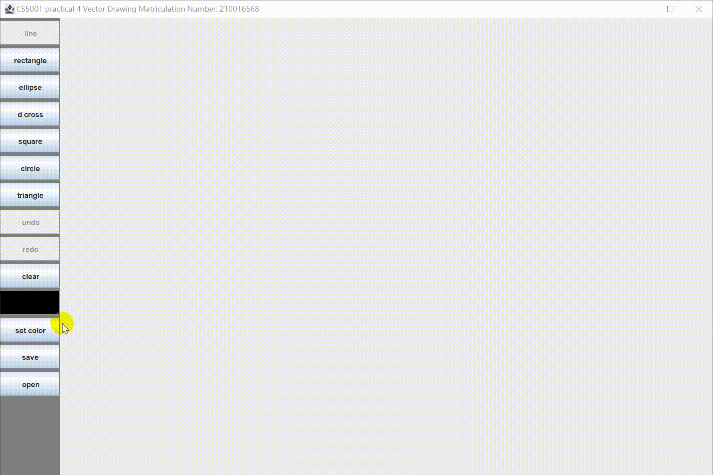

# README

Report for CS5001 practical 4 vector drawing。

author: **[210016568](mailto:zg34@st-andrews.ac.uk)**

## Abstract

This readme will illustrate the process by which I implemented the GUI for the vector drawing.

This document is more of a description of the requirement I met. For further explanation, it can be found in the `JavaDoc`.

## Design Pattern

This project use the Model–View–Controller (MVC) design pattern. 

## Basic Requirements

For basic requirements, I implemented all. I used a gif to show how is it gong.


## Advanced Requirements

###  Square and Circle

I do not use the shift key to achieve the square and circle, I give two new button to implement it. it also can be seen as above gif showed.

### Triangle

I added triangle shape.

### Load and save vector drawings

#### Load File

here I put a file named `example.ser` to show how to reload a file from disk.


#### Save File

I present the process how to use this tool to store the vector drawing as a file.



## JUnit

For the `JUnit`, I passed all the test I designed before. showed in image.


### `testAddVector()`

```java
@Test
public void testAddVector() {
    Assert.assertTrue(model.isUndoStackEmpty());
    Assert.assertTrue(model.isRedoStackEmpty());
    model.addVector(vector1);
    Assert.assertFalse(model.isUndoStackEmpty());
    Assert.assertTrue(model.isRedoStackEmpty());
    model.addVector(vector2);
    Assert.assertEquals(model.getVectorList().toArray().length, 2);
    Assert.assertEquals(model.getVectorList().get(0), vector1);
    Assert.assertEquals(model.getVectorList().get(1), vector2);
}
```

I test the `addVector()` method by measuring the size of `vectorList`.

### `testUndoRedoClear()`

```java
@Test
public void testUndoRedoClear() {
    model = new Model();
    model.addVector(vector1);
    model.addVector(vector2);
    model.undo();
    Assert.assertEquals(model.getVectorList().toArray().length, 1);
    Assert.assertFalse(model.isUndoStackEmpty());
    Assert.assertFalse(model.isRedoStackEmpty());
    model.undo();
    Assert.assertEquals(model.getVectorList().toArray().length, 0);
    Assert.assertTrue(model.isUndoStackEmpty());
    Assert.assertFalse(model.isRedoStackEmpty());
    model.addVector(vector2);
    Assert.assertFalse(model.isUndoStackEmpty());
    Assert.assertTrue(model.isRedoStackEmpty());
    model.clear();
    Assert.assertTrue(model.getVectorList().isEmpty());
}
```

test the redo, undo and clear function by comparing the size too

### `testSaveAndReload()`

```java
@Test
public void testSaveAndReload() {
    model = new Model();
    model.addVector(vector1);
    model.addVector(vector2);
    SaveAsFile saved = model.save();
    model.reload(saved);
    Assert.assertEquals(model.getVectorList(), saved.getVectorList());
    Assert.assertEquals(model.getRedoStack(), saved.getRedoStack());
    Assert.assertEquals(model.getUndoStack(), saved.getUndoStack());
}
```

test the save and reload function for the model by comparing the vector list, undo stack and redo stack.

## How to run it

I have built the jar file to run it. In CMD, run as follow when cd the root path of this project.

```
java -jar CS5001-p4-vector-drawing.jar
```

Or also can compile all the .java file in every folder with java file,

```
javac *.java
```

then cd at `src\main` folder, run

```
java MVCMain.class
```

